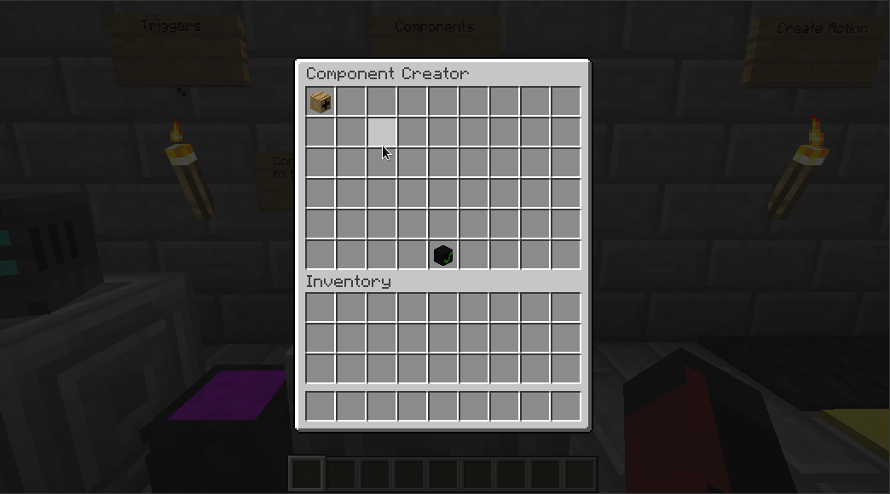

# Guiy
[](https://github.com/MineInAbyss/DeeperWorld/actions/workflows/main.yml)
[](https://repo.mineinabyss.com/releases/com/derongan/minecraft/guiy)
[](https://github.com/MineInAbyss/MineInAbyss/wiki/Setup-and-Contribution-Guide)



Guiy is a general purpose library for creating chest GUIs. It is an easy 
way to create navigatable guis with powerful functionality, such as
on click events and user input.

Guiy was written against Minecraft version 1.15.2, but should work for higher
versions (and probably lower versions as well). If it doesn't work for something let me know and I'll take a look.

Guiy was made with creative mode in mind, so treats all clicks the same (clients in
creative mode do not distinguish between different types of inventory 
click events).

# Some Features
* Layout - Holds multiple other elements
* ClickableElement - Invokes a callback on click
* NumberInput - Input a (positive at the moment) floating point value
* BooleanInput - Input a boolean value
* FixedStringInput - Choose a single string from a list of possible strings
* VerticalScrollingElement - Allow vertical scrolling of an element
* ScrollingPallet - Horizontally scrolling element fixed at one slot high
* FillableElement - Allows adding other elements to it at next available position

# Examples

Guiy abstracts the chest GUI into a number of elements. Most elements
wrap other elements to provide additional functionality. A root element
is added to a `GuiHolder`, and item holder that passes all click events
through the element tree.

You must register an `InventoryClickEvent` listener in your plugin which
wraps and passes click events to the holder. A simple listener is provided
in `com.derongan.minecraft.guiy.GuiListener`. You can register this if
you want.

## Create simple view and swap to a new view
```java
Layout secondView = ...
Layout firstView = new Layout();
Element cell = Cell.forMaterial(Material.DIAMOND_BLOCK, "Button");
ClickableElement button = new ClickableElement(cell);

firstView.addElement(0, 0, button);

SwappableElement swappable = new SwappableElement(firstView);

button.setClickAction(clickEvent -> {
    swappable.swap(secondView);
});

GuiHolder guiHolder = new GuiHolder(6, "Gui with second view", firstView, yourPlugin);

guiHolder.show(player);
```

## Handle numeric user input
```java
Layout layout = new Layout();
Element cell = Cell.forMaterial(Material.DIAMOND_BLOCK, "Submit Number");
ClickableElement button = new ClickableElement(cell);
NumberInput numberInput = new NumberInput();

layout.addElement(4, 5, button);
layout.addElement(0, 0, numberInput);

button.setClickAction(clickEvent -> {
    numberInput.onSubmit();
});

numberInput.setSubmitAction(number -> {
    player.sendMessage(String.format("You entered %f", number));
});

GuiHolder guiHolder = new GuiHolder(6, "Gui with number input", layout, yourPlugin);

guiHolder.show(player);
```

# Usage

- Depend on [KotlinSpice](https://github.com/CultOfClang/KotlinSpice) in your plugin config, and request users to download
the plugin to their server.
- Or: Manage [shading](https://imperceptiblethoughts.com/shadow/) Kotlin. Shading Kotlin can cause hard-to-find errors if two different versions are present during runtime!

**!! We are now using Github Packages which you can depend on similar to our other library, [Idofront](https://github.com/MineInAbyss/Idofront), but it is a bit more annoying, and JitPack will probably still work.**

## Use with Gradle
```groovy
repositories {
    maven {
        name = 'jitpack'
        url = "https://jitpack.io"
    }
}

dependencies {
    implementation group: 'com.github.MineInAbyss', name: 'guiy', version: "master-SNAPSHOT"
}
```

Be sure to shade Guiy! It is recommended that you relocate the jar into a unique package in order to avoid problems when different plugins are using different versions of Guiy. We may eventually release this project as a separate plugin and this step will not be needed.

```groovy
shadowJar {
    relocate 'com.derongan.minecraft.guiy', "${project.group}.${project.name}.guiy".toLowerCase()

    minimize {
        exclude(dependency('de.erethon:headlib:3.0.2'))
    }
}
```

Minimize will only shade classes you are using and does not seem to cause problems with Guiy. It does cause problems with headlib however, so you must exclude it from minimization.

## Use with Maven
```xml
<repositories>
    <repository>
        <id>jitpack.io</id>
        <url>https://jitpack.io</url>
    </repository>
</repositories>

<dependency>
    <groupId>com.github.MineInAbyss</groupId>
    <artifactId>guiy</artifactId>
    <version>master-SNAPSHOT</version>
</dependency>
```

Do the equivalent of shading with Gradle, and relocate the jar into a unique package if possibe, as described in the `Use with Gradle` section.

## Advanced - Protobuf Support
This is probably very specific to the problem I was solving when I made Guiy, 
but Guiy supports Protocol buffer inputs out of the box. 

Say we have the following protocol buffer definition:

```proto
package com.something.test.proto;

message Thing {
    enum Color{
        RED = 0;
        BLUE = 1;
        YELLOW = 2;
    }
    
    Color color = 1;
    double value = 2;
}
```

We can create an input that will create a message for this type like so:

```java
// Construct the initial message state. Values will be preserved if unchanged.
Thing thing = Thing.newBuilder().setValue(2).build;
ProtobufInput<Thing> protobufInput = new ProtobufInput<>(thing);

thing.setSubmitAction(newThing -> {
    // newThing is a message of type Thing.
});
```

## Thanks

Many thanks to Daniel Saukel for [Headlib](https://github.com/DRE2N/HeadLib), which makes life so much easier.
